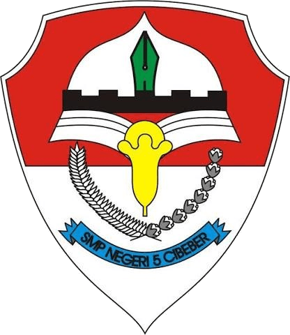

<div align="center">

  

  # 🌿 SMP NEGERI 5 CIBEBER
  ### *Website Profil Resmi & Portal Informasi Terpadu*
  **"The Inspiring School of Cibeber"**

  <p align="center">
    Lembaga Pendidikan Menengah Negeri yang Berfokus pada Pembentukan Budi Pekerti, Keunggulan Akademik, dan Kelestarian Lingkungan di Kabupaten Lebak, Provinsi Banten.
  </p>

  <p align="center">
    <a href="https://nextjs.org"></a>
    <a href="https://react.dev"></a>
    <a href="https://www.typescriptlang.org"></a>
    <a href="https://tailwindcss.com"></a>
    <a href="https://supabase.com"></a>
    <a href="https://motion.dev"></a>
  </p>

  <p align="center">
    <a href="#-fitur-utama">Fitur Utama</a> •
    <a href="#-teknologi--arsitektur">Teknologi</a> •
    <a href="#-halaman--modul-publik">Halaman Web</a> •
    <a href="#-instalasi--menjalankan-proyek">Panduan Instalasi</a> •
    <a href="#-arsitektur-data--keamanan">Keamanan & Performa</a>
  </p>
</div>

---

## 🌟 Tentang Proyek

Website Profil **SMP Negeri 5 Cibeber** adalah portal publik modern berstandar institusi pendidikan prestisius. Dibangun menggunakan arsitektur **Next.js 16 App Router (Turbopack)** dengan pendekatan *Server-First Components* yang terintegrasi secara *real-time* ke **Supabase Cloud PostgreSQL** sebagai sumber kebenaran tunggal (*Single Source of Truth*).

Platform ini dirancang khusus untuk merefleksikan identitas sekolah yang **asri, berakar budaya lokal Lebak, berprestasi, dan berwawasan lingkungan hidup (Adiwiyata)**.

---

## ✨ Fitur Utama

- 🏛️ **Institutional Prestige Hero Section**: Background slider sinematik foto kampus asli berkecepatan 4.5 detik dengan tipografi bold dan halo anti-samar.
- ⚡ **Dual-Speed Adaptive Counter**: Bar statistik mengambang (Akreditasi B, 20+ Tahun, Prestasi Kejuaraan, Dewan Guru) yang berjalan ritmis pelan dan otomatis melejit kilat saat pengguna menggulir layar (*scroll-triggered acceleration*).
- 🎓 **Direktori Guru Bergaya Editorial Majalah**:
  - Tampilan kartu potret modern dengan *Academic Monogram Seal* bertekstur emas/zamrud untuk guru tanpa foto.
  - *Interactive Slide-Over Drawer* berisi kredensial lengkap, almamater kampus, tugas pembinaan, dan tombol satu-klik **"Salin NIP"**.
  - Sinkronisasi instan dengan modul CMS Dewan Guru di Portal Superadmin.
- 🏆 **Hall of Fame & Arsip Prestasi**: Galeri penghargaan piala kejuaraan siswa (Marching Band, FLS2N, Pramuka, Olahraga) yang terkelompok berdasarkan tahun.
- 🏹 **Ekstrakurikuler & Pembinaan Bakat**: Direktori kegiatan kesiswaan dengan hero banner terpadu, filter kategori (Kepanduan, Olahraga, Kesenian, Religi), jadwal, pelatih, dan target prestasi.
- 📰 **Portal Risalah & Warta Sekolah**: Artikel berita, artikel literasi, pengumuman resmi, dan dokumentasi kegiatan dengan pagination dan pencarian cepat.
- 🍃 **Filosofi & Visi Misi Adiwiyata**: Penyajian visi, misi, dan pilar pendidikan sekolah berhias motif tradisional *Mega Mendung Banten*.
- 🛡️ **Zero-Overhead ISR Caching**: Data dinamis Supabase dicache otomatis selama 30 detik melalui Next.js Incremental Static Regeneration (ISR).

---

## 🛠️ Teknologi & Arsitektur

| Layer | Teknologi | Peran & Deskripsi |
| :--- | :--- | :--- |
| **Framework** | [Next.js 16 (Turbopack)](https://nextjs.org) | App Router, Server Components, Static Prerendering |
| **UI Library** | [React 19](https://react.dev) | Komponen UI reaktif, concurrent rendering |
| **Bahasa** | [TypeScript 6](https://www.typescriptlang.org) | Type-safety menyeluruh dari API hingga DOM |
| **Styling** | [Tailwind CSS v4](https://tailwindcss.com) | Modern styling engine dengan zero-runtime CSS |
| **Database** | [Supabase Cloud](https://supabase.com) | PostgreSQL terkelola dengan Row Level Security (RLS) |
| **Animasi** | [Motion](https://motion.dev) | Micro-interactions, slide-over drawer, dan scroll animations |
| **Icon Pack** | [Phosphor Icons](https://phosphoricons.com) | Ikon akademik & duotone modern |

---

## 📂 Struktur Direktori

```text
WEB-profiel-SMP5CIBEBER/
├── app/
│   ├── (public)/                 # Rute Halaman Publik
│   │   ├── page.tsx              # Beranda (Hero, Stats, Sambutan, Berita)
│   │   ├── agenda/               # Agenda & Kalender Kegiatan
│   │   ├── berita/               # Portal Berita & [slug] Detail Baca
│   │   ├── ekstrakurikuler/      # Direktori Ekskul Siswa
│   │   ├── fasilitas/            # Sarana & Prasarana Kampus
│   │   ├── galeri/               # Dokumentasi Foto & Video
│   │   ├── kontak/               # Formulir Hubungi & Navigasi Peta
│   │   ├── ppdb/                 # Informasi Penerimaan Peserta Didik Baru
│   │   ├── prestasi/             # Rekam Jejak Prestasi & Kejuaraan
│   │   └── profil/               # Sejarah, Visi Misi, & Direktori Guru
│   ├── admin/                    # Smart Redirect ke Portal Superadmin
│   ├── globals.css               # Desain Sistem & Konfigurasi Tailwind v4
│   └── layout.tsx                # Root Shell & Font Academic Serif
├── components/
│   ├── layout/                   # Navbar, Mega Menu, & Footer Institusional
│   └── ui/                       # TeacherDirectory, HomeStatsCounter, HeroSlider, dll.
├── lib/
│   ├── supabaseData.ts           # Client Server Data Fetcher + ISR Revalidation
│   ├── staffData.ts              # Data Guru Fallback & Tipe Staf
│   ├── ekskul-data.ts            # Data Cadangan Ekstrakurikuler
│   └── utils.ts                  # Formatter Tanggal & Helper Utility
└── public/
    └── assets/                   # Foto Kampus & Banner Terkompresi (~100-200 KB)
```

---

## 🚀 Panduan Instalasi & Menjalankan Proyek

### 1. Prasyarat
- **Node.js** versi `18.18.0` atau lebih baru
- **npm**, **yarn**, atau **pnpm**

### 2. Kloning Repositori
```bash
git clone git@github.com:daerobi-devs/web-profiel-smpn5cibubur.git
cd web-profiel-smpn5cibubur
```

### 3. Konfigurasi Lingkungan (`.env`)
Buat file `.env` di *root* direktori proyek:
```env
# URL Akses Aplikasi
NEXT_PUBLIC_APP_URL="http://localhost:3001"
NEXT_PUBLIC_APP_NAME="SMPN 5 Cibeber"
NEXT_PUBLIC_ADMIN_PORTAL_URL="http://localhost:3000"

# Kredensial Supabase Cloud (Single Source of Truth)
NEXT_PUBLIC_SUPABASE_URL="https://bgyeqdyguuflljgzilzy.supabase.co"
NEXT_PUBLIC_SUPABASE_ANON_KEY="eyJhbGciOiJIUzI1NiIsInR5cCI6IkpXVCJ9..."
```

### 4. Instalasi Dependensi
```bash
npm install
```

### 5. Jalankan Mode Pengembangan (*Dev*)
```bash
npm run dev
```
Buka browser di **[http://localhost:3001](http://localhost:3001)** untuk melihat website.

### 6. Build Produksi
```bash
npm run build
npm run start
```

---

## 🔒 Keamanan & Optimasi Performa

1. **Proteksi Kredensial**:
   - Hanya menggunakan `anon` public key dengan pembatasan hak baca (*read-only*) via Row Level Security (RLS) PostgreSQL.
   - Tidak ada kebocoran kunci rahasia (*secret keys*) di sisi klien.
2. **Anti Beban Server (*Zero-Overhead*)**:
   - Seluruh kueri publik di-*cache* selama 30 detik (`revalidate: 30`). Lonjakan ribuan pengunjung tidak akan membebani database Supabase.
   - Kueri artikel dioptimasi tanpa menyertakan kolom teks panjang (`content`) pada halaman daftar, menghemat *bandwidth* hingga **90%**.
3. **Aset Gambar Ringan**:
   - Seluruh foto latar belakang dikompresi berstandar WebP/JPEG ringan (~100–220 KB) tanpa mengurangi kejernihan visual retina.

---

<div align="center">
  <p>Dikelola dengan ❤️ dan dedikasi oleh <b>Tim IT & Dewan Guru SMP Negeri 5 Cibeber</b></p>
  <p><i>Kecamatan Cibeber, Kabupaten Lebak, Provinsi Banten 42394</i></p>
</div>
